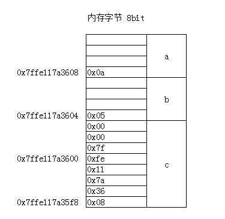
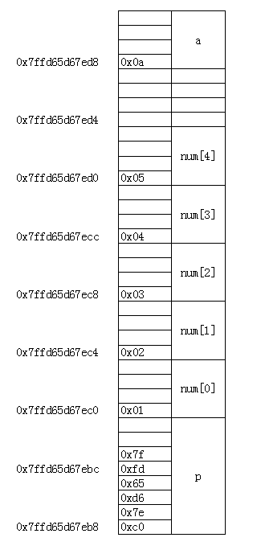
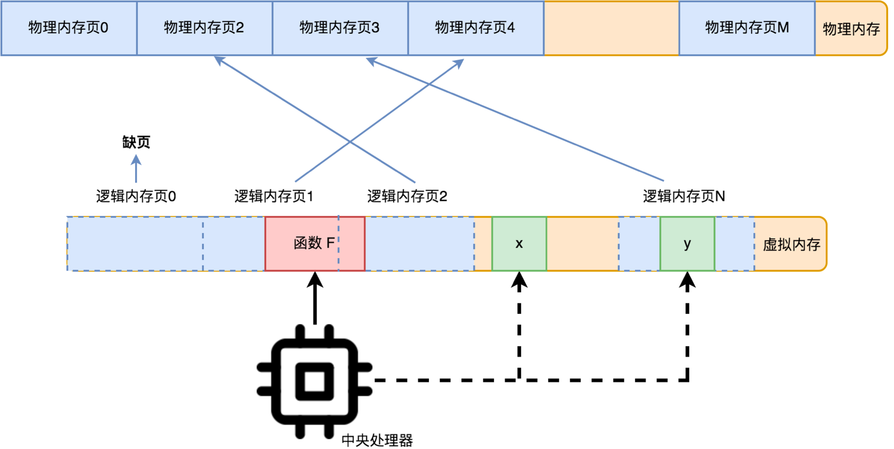

不讲述C语言中指针，令人难以理解的看起来很奇怪的用法。单纯的讲述指针和地址之间微妙的关系

# 看看对指针的基本了解
* 大端模式 小端模式（大尾小尾 大头小头）
* 内存对齐

内存+地址  -----  指针

指针的移动

# 指针是C语言所特有的、底层的邪恶的功能？
* 没有指针就没有链表和树等数据结构
* 没有指针是写不出像样的应用程序的
* Java也是有指针的，Java从语法上努力隐藏指针，让指向某对象的指针看起来更像那个对象本身
* 指针和对象 -- 复制指针要容易的多（值传递 地址传递）

# 大端模式 小端模式
* 大端模式：指数据的高字节保存在内存的低地址
* 小端模式：指数据的低字节保存在内存的低地址（常用系统）
```
int a = 10;
int b = 5;
int *c = &a;
printf("%lp, %d\n%lp, %d\n%lp, %d\n%p\n%d", &a, sizeof(&a), &b, sizeof(&b),&c, sizeof(&c), c, *c);


0x7ffe117a3608, 8
0x7ffe117a3604, 8
0x7ffe117a35f8, 8
0x7ffe117a3608
10
```

* 看懂了这张内存示意图，就能理解绝大多数内存问题。
* 下面再考虑数组存储
```
int a = 10;
printf("%p %d\n", &a, a);
int num[] = {1, 2, 3, 4, 5};
int *p = num;
printf("%p %p\n", &p, p);
for(int i = 0 ; i < 5; i++){
    printf("%p %d\n", p, *p);
    p++;
}

0x7ffd65d67ed8 10
0x7ffd65d67eb8 0x7ffd65d67ec0 
0x7ffd65d67ec0 1
0x7ffd65d67ec4 2
0x7ffd65d67ec8 3
0x7ffd65d67ecc 4
0x7ffd65d67ed0 5
```

==========================================
* ==问题又来了，num数组的本身，num存在哪里？？？？？？？？？==
* 指针运算：对指针进行+1运算，地址的值会增加当前指针随之想数据类型的长度。int指针+1，移动32位，4字节
* 这个时候，我们可以解释更多的问题了。由于C语言的指针没有越界问题，p[6]可以直接修改a的值。。。
* 特别的是，下标运算符其实是语法糖。 num[i]等价于*(num + i)，一个明显的证据就是加法的交换律
* num[i]和i[num]能得到同样的结果，并且不会报错
* 早起使用指针编写程序，在一定程度上牺牲了可读性，换取了性能。在编译器优化的今天，其实用指针和用下标最终生成的代码是一样的。所以，在一定程度上，尽量减少指针的使用
* 在某些领域，例如网络通讯字节(char)流的读取，指针依旧有这巨大的优势
* 指针和数组时不同的事物

# 内存管理模式
## 实模式
* 在实模式操作系统下，所有软件包括操作系统本身，都在同一个物理地址空间下。在 CPU 看来，它们是同一个程序
  * 安全性。操作系统以及所有软件都运行在一起，相互之间可以随意修改对方的数据甚至程序指令
  * 支持的软件复杂性低，同时可运行的软件数量少
## 保护模式
* 为什么平常我们可以毫无顾忌地不断打开新的软件，从来不曾担心过内存会不足呢
* 保护模式下，内存访问不再是直接通过物理内存，而是基于虚拟内存
* 虚拟内存模式下，整个内存空间被分成很多个连续的内存页。每个内存页大小是固定的，比如 64K
* 每次 CPU 访问某个虚拟内存地址中的数据，它都会先计算出这是要访问哪个内存页，然后 CPU 再通过一个地址映射表，把虚拟的内存地址转为物理的内存地址
* 地址映射表是一个数组，下标是内存页页号，值是该内存页对应的物理内存首地址
* 也有可能某一个内存页对应的物理内存地址还不存在，这种情况叫缺页，没法读取数据，这时 CPU 就会发起一个缺页的中断请求
* 没有空闲的物理内存可以分配，它就会选择一个最久没有被访问的内存页进行淘汰


# 内存对齐
